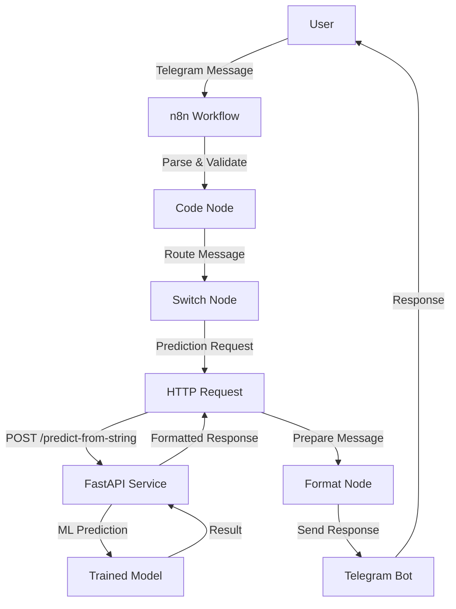

# 🏠 ML Housing Price Prediction Bot

[](https://www.python.org/)
[](https://fastapi.tiangolo.com/)
[](https://www.docker.com/)
[](LICENSE)

> **A complete end-to-end machine learning pipeline that predicts California housing prices through a Telegram bot interface powered by n8n workflows.**

## 🚀 Overview

This project demonstrates a production-ready ML pipeline featuring:

- **ML Model**: RandomForestRegressor trained on California Housing dataset
- **API**: FastAPI service with multiple prediction endpoints  
- **Bot Integration**: Telegram bot with n8n workflow automation
- **Containerization**: Docker support for easy deployment
- **Multi-format Input**: Support for JSON and CSV string inputs

## 🏗️ Architecture



## ✨ Features

### 🎯 Core Functionality
- **Multi-Input Support**: Accept structured JSON or comma-separated strings
- **Currency Conversion**: EUR/USD conversion with configurable rates
- **Rich Responses**: Plain text and HTML-formatted messages for Telegram
- **Model Validation**: Health checks and model status endpoints
- **Error Handling**: Comprehensive error responses with user-friendly messages

### 🔧 Technical Features
- **Containerized Deployment**: Docker & Docker Compose ready
- **Environment Configuration**: Flexible configuration via environment variables
- **Async API**: Built with FastAPI for high performance
- **Model Persistence**: Joblib-based model serialization
- **Pipeline Architecture**: Scikit-learn pipeline with preprocessing

## 📋 Prerequisites

- **Python 3.8+**
- **Docker & Docker Compose** (recommended)
- **n8n Instance** (cloud or self-hosted)
- **Telegram Bot Token** (from BotFather)

## 🚦 Quick Start

### 1. Clone the Repository
```bash
git clone https://github.com/avaazquezz/ml-housing-n8n.git
cd ml-housing-n8n
```

### 2. Environment Setup
Create a `.env` file in the project root:

```env
# Model Configuration
MODEL_WAIT_TIMEOUT=60
PRICE_MULTIPLIER=100000.0
EUR_TO_USD=1.10
TARGET_TRANSFORM=none
MODEL_PATH=/app/model/model.joblib

# API Configuration
API_HOST=0.0.0.0
API_PORT=8000
```

### 3. Deploy with Docker (Recommended)

```bash
# Build and start services
docker-compose up -d

# Check service status
docker-compose ps

# View logs
docker-compose logs -f api
```

### 4. Local Development Setup

```bash
# Install dependencies
pip install -r requirements.txt

# Train the model (optional)
python scripts/train.py

# Start the API server
uvicorn app.main:app --host 0.0.0.0 --port 8000 --reload
```

### 5. Verify Installation

```bash
# Health check
curl http://localhost:8000/health

# Test prediction
curl -X POST "http://localhost:8000/predict-from-string" \
  -H "Content-Type: application/json" \
  -d '{"input":"4.2,15,5.3,1.2,1800,3.1,34.05,-118.25"}'
```

## 📚 API Documentation

### Endpoints Overview

| Method | Endpoint | Description |
|--------|----------|-------------|
| `GET` | `/` | API information and status |
| `GET` | `/health` | Health check and model status |
| `POST` | `/predict` | Structured JSON prediction |
| `POST` | `/predict-from-string` | CSV string prediction |

### 📝 Request/Response Examples

#### Structured Prediction

**Request:**
```bash
curl -X POST "http://localhost:8000/predict" \
  -H "Content-Type: application/json" \
  -d '{
    "MedInc": 4.2,
    "HouseAge": 15,
    "AveRooms": 5.3,
    "AveBedrms": 1.2,
    "Population": 1800,
    "AveOccup": 3.1,
    "Latitude": 34.05,
    "Longitude": -118.25
  }'
```

#### String-based Prediction

**Request:**
```bash
curl -X POST "http://localhost:8000/predict-from-string" \
  -H "Content-Type: application/json" \
  -d '{"input":"4.2,15,5.3,1.2,1800,3.1,34.05,-118.25"}'
```

**Response:**
```json
{
  "prediction": 193101.0,
  "prediction_eur": 193101.0,
  "prediction_usd": 212411.1,
  "prediction_eur_formatted": "193,101.00 EUR",
  "prediction_usd_formatted": "212,411.10 USD",
  "status": "success",
  "message_text": "🏠 Estimated price: 193,101.00 EUR / 212,411.10 USD\n\nStatus: success",
  "message_html": "🏠 <b>Estimated price</b>\n193,101.00 EUR / 212,411.10 USD\n\n✅ <b>Status</b>: success"
}
```

## 🤖 Telegram Bot Setup

### 🚀 Try the Live Demo Bot

**Bot URL**: https://t.me/HouseValuePredictorBot

### 1. Create Your Own Bot with BotFather

```bash
# Start conversation with BotFather
/newbot

# Set bot commands
/setcommands
start - Show welcome message and usage instructions
```

### 2. Bot Commands Configuration

Use this JSON payload to set commands programmatically:

```bash
curl -X POST "https://api.telegram.org/bot<YOUR_BOT_TOKEN>/setMyCommands" \
  -H "Content-Type: application/json" \
  -d '{
    "commands": [
      {"command":"start","description":"Show welcome & usage instructions"},
      {"command":"predict","description":"Predict house price"},
      {"command":"help","description":"Show help & example"}
    ]
  }'
```

### 3. Example Input Format

Send this message to the bot:
```
4.2,15,5.3,1.2,1800,3.1,34.05,-118.25
```

**Parameter Order:**
1. `MedInc` - Median income
2. `HouseAge` - House age
3. `AveRooms` - Average rooms
4. `AveBedrms` - Average bedrooms  
5. `Population` - Population
6. `AveOccup` - Average occupancy
7. `Latitude` - Latitude
8. `Longitude` - Longitude

## 🔧 n8n Workflow Configuration

### 📊 Workflow Visual Overview

The n8n workflow follows this structure:

**Telegram Trigger** → **Code Node** → **Switch Node** → **API/Response Nodes**

```
┌─────────────────┐    ┌──────────────┐    ┌─────────────┐
│ Telegram        │    │ Code Node    │    │ Switch      │
│ Trigger         │───▶│ (Parse &     │───▶│ (Route by   │
│ (Receive msg)   │    │ Validate)    │    │ mode)       │
└─────────────────┘    └──────────────┘    └─────────────┘
                                                  │
                        ┌─────────────────────────┼─────────────────────────┐
                        │                         │                         │
                        ▼                         ▼                         ▼
              ┌─────────────────┐       ┌─────────────────┐       ┌─────────────────┐
              │ HTTP Request    │       │ Send Welcome    │       │ Send Error      │
              │ (API Call)      │       │ (Instructions)  │       │ (Invalid input) │
              └─────────────────┘       └─────────────────┘       └─────────────────┘
                        │
                        ▼
              ┌─────────────────┐
              │ Send Prediction │
              │ (Formatted)     │
              └─────────────────┘
```

*For detailed workflow configuration, see [`docs/n8n-workflow.md`](docs/n8n-workflow.md)*

### Workflow Nodes Structure

1. **Telegram Trigger** - Receives incoming messages
2. **Code Node** - Parses and validates input
3. **Switch Node** - Routes based on message type
4. **HTTP Request** - Calls prediction API
5. **Set Node** - Formats response message
6. **Telegram Send** - Sends formatted response

### Key n8n Expressions

```javascript
// Extract chat ID
{{$json["message"]["chat"]["id"]}}

// Extract message text
{{$json["message"]["text"]}}

// Normalize input text
const raw = $json["message"]?.text || "";
const normalized = raw.trim().replace(/\u00A0/g, " ").replace(/;/g, ",");

// API response mapping
{{$node["HTTP Request"].json["message_html"]}}
```

### Import Workflow

1. Copy the workflow from `n8n/Workflow_HPP-ML.json`
2. Import into your n8n instance
3. Configure Telegram credentials
4. Update API endpoint URL
5. Activate the workflow

### 🎯 Detailed Node Configuration

#### 1. Telegram Trigger Node
- **Updates**: `message`
- **Webhook URL**: Configure your webhook endpoint
- **Credentials**: Add your Telegram Bot API credentials

#### 2. Code Node (Message Processing)
```javascript
// Detect mode (welcome / predict / error)
const message = ($json?.message?.text ?? $json?.message ?? $json?.text ?? "").toString().trim();

let mode = "";
const m = message.toLowerCase();

// /start -> welcome
if (m === "/start") {
  mode = "welcome";
} 
// Predict -> exactly 8 numbers separated by commas
else if (/^\s*-?\d+([.,]\d+)?\s*(,\s*-?\d+([.,]\d+)?\s*){7}$/.test(message)) {
  mode = "predict";
} 
// Any other case -> error
else {
  mode = "error";
}

return [{
  json: {
    chat_id: $json?.message?.chat?.id ?? $json?.chat_id ?? null,
    message,
    mode
  }
}];
```

#### 3. Switch Node
- **Mode**: Routes based on `{{$json.mode}}`
- **Routes**: 
  - `welcome` → Send Welcome message
  - `predict` → HTTP Request to API
  - `error` → Send Error message

#### 4. HTTP Request Node (API Call)
- **Method**: POST
- **URL**: `https://your-api-endpoint.com/predict-from-string`
- **Body**: 
  ```json
  {
    "input": "{{$json.message}}"
  }
  ```

#### 5. Send Nodes (Telegram Response)
- **Chat ID**: `{{$json.chat_id}}`
- **Message**: `{{$node["HTTP Request"].json["message_html"]}}`
- **Parse Mode**: HTML (for formatted responses)

## 🐳 Docker Configuration

### Services Overview

- **trainer**: Trains the ML model and saves it
- **api**: Serves the FastAPI prediction service

### Commands

```bash
# Build and start
docker-compose up -d

# Rebuild services
docker-compose up -d --build

# View logs
docker-compose logs -f

# Stop services
docker-compose down

# Clean up
docker-compose down -v --remove-orphans
```

## 🔍 Model Details

### Dataset
- **Source**: California Housing Dataset (scikit-learn)
- **Features**: 8 numerical features
- **Target**: Median house value (in hundreds of thousands of dollars)

### Pipeline Components
1. **StandardScaler**: Feature normalization
2. **RandomForestRegressor**: Main prediction model
   - n_estimators: 100
   - random_state: 42
   - n_jobs: -1 (parallel processing)

### Performance Considerations
- The model is trained on 1990 California data
- Predictions are estimates and should not be used for real financial decisions
- Consider retraining with more recent data for production use

## 🛠️ Development

### Project Structure
```
ml-housing-n8n/
├── app/
│   └── main.py              # FastAPI application
├── model/
│   └── model.joblib         # Trained ML model
├── n8n/
│   ├── My workflow.json     # n8n workflow configuration
│   └── README-n8n.md        # n8n setup instructions
├── scripts/
│   └── train.py             # Model training script
├── docker-compose.yml       # Docker services configuration
├── Dockerfile               # Container build instructions
├── requirements.txt         # Python dependencies
└── README.md               # This file
```

### Running Tests

```bash
# Install test dependencies
pip install pytest pytest-asyncio httpx

# Run tests
pytest

# Run with coverage
pytest --cov=app tests/
```

### Code Style

```bash
# Install formatting tools
pip install black isort flake8

# Format code
black .
isort .

# Lint code
flake8 .
```

## 📄 License

This project is licensed under the MIT License - see the [LICENSE](LICENSE) file for details.

## 🤝 Contributing

1. Fork the repository
2. Create a feature branch (`git checkout -b feature/amazing-feature`)
3. Commit your changes (`git commit -m 'Add amazing feature'`)
4. Push to the branch (`git push origin feature/amazing-feature`)
5. Open a Pull Request

## 📞 Support

- **Issues**: [GitHub Issues](https://github.com/avaazquezz/ml-housing-n8n/issues)
- **Discussions**: [GitHub Discussions](https://github.com/avaazquezz/ml-housing-n8n/discussions)
- **Documentation**: Check the `n8n/README-n8n.md` for n8n specific setup

## 🙏 Acknowledgments

- California Housing Dataset from scikit-learn
- FastAPI framework for the excellent async API capabilities
- n8n community for workflow automation inspiration
- Telegram Bot API for seamless integration

---

<div align="center">

**⭐ If this project helped you, please consider giving it a star! ⭐**

Made with ❤️ by [avaazquezz](https://github.com/avaazquezz)

</div>
